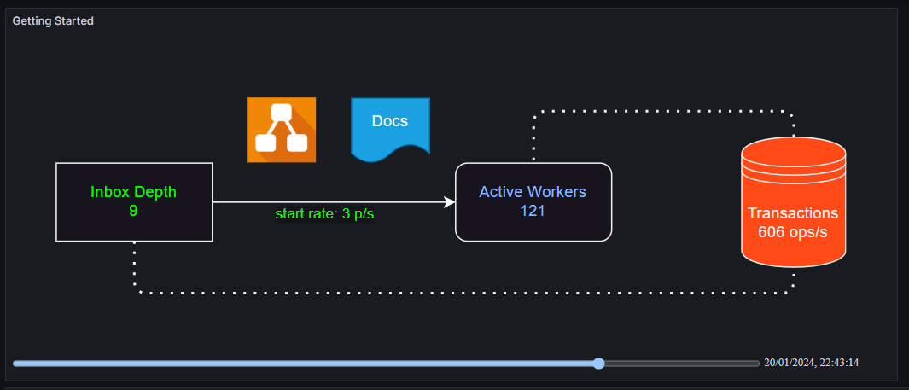
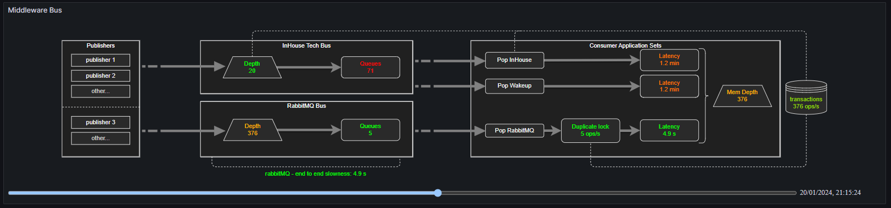

# Grafana Flow Panel Plugin

This repository contains the documentation and examples for the [Grafana Flow Panel Plugin](https://github.com/andymchugh/andrewbmchugh-flow-panel).

## Example 1

## Example 2

## Why write the plugin?
Many dashboards benefit from having an architecture flow diagram detailing the shape of the system and showing a snaphot of all the metrics side by side. Up until now (January 2024) it's been supported by the [flowcharting plugin](https://github.com/algenty/grafana-flowcharting). Unfortunately that plugin is no longer maintained and is underpinned by Angular, so will stop working later in 2024 when Grafana 11 is released.

The Grafana alternative is the Canvas panel. That's a clear winner for animated widgets on a canvas background but it's not certain when it will evolve sufficiently to support flowcharts. The challenge they've chosen is to write their own diagramming editor in-situ within the panel editor. It's a big mountain to climb.

Grafana (in canvas issues chats) have been suggesting the [ACE-SVG](https://github.com/ACE-IoT-Solutions/ace-svg-react) panel, as an alternative to Canvas, for when people want to annotate an SVG. However, as of Grafana 10.1, that has also stopped working and is no longer being supported.

Given all of the above, I felt there was a need for another flowchart offering. What I've aimed to write is:
- A panel based off of the latest Grafana cookie-cutter leveraging REACT Functional Components.
- A panel that would *rust* slowly. i.e. hardly any bespoke imports.
- A panel that would simplify maintenance. i.e. actively support configuration sharing.
- A panel that would support tailoring via grafana variables. i.e. dynamic threshold configuration. 

## Feature Set
The plugin content is defined with three data files:
- SVG: This defines the flowchart with controllable widgets identified via the cell IDs.
- PanelConfig: Defined in yaml, this associates the above cell IDs with time-series, thresholds, links and visualization config.
- SiteConfig: Defined in yaml, this provides cross-panel shared configuration such as thresholds, links, colors, etc.

The data files can be pasted into the panel, but they can alternatively be loaded from external URLs such as github. When first rendered the panel shows the flowchart at *last-values*. i.e. the end of the time-window. But this is movable. A Time-Slider at the bottom of the panel allows the full timeseries to be traversed so you can see how the flow evolves over the time window.

The supported visualizations are:
- label content
- label color
- fill color
- links

*Note that tooltips have no inbuilt support in the panel, but can be defined in the SVG and will appear in the panel on-hover courtesy of the underlying framework. To set a tooltip in draw.io, `select widget -> Edit -> Edit Tooltip`; or `select widget -> <ALT><SHFT>T`.*

## Getting started
Create a Flow Panel in your dashboard. The initial setup loads the first example from this repo via urls. It also enables *test-timeseries-enrichment*. These test timeseries ensure the initial dashboard has some data to show. It gives you a working example straight out of the box.

### Explore
- Scale:
  - Change the size and shape of the grafana panel. See the SVG automatically scale to fill the content whilst maintaining aspect ratio.
- Time Slider:
  - Drag the time-slider back and forth. See the flow labels, label colors, fill colors change according to the defined thresholds.
  - Open the panel editor and disable the time slider to see the SVG expand into the additional space and revert to *last values*.
- SVG and Config References:
  - Edit the SVG reference and see the SVG dissapear. Change it back and see it reappear.
  - Edit the Panel Config reference and see the annotation dissapear. Change it back and see it reappear.
  - Change the links over to the second example to see the bus middleware example:
    - svg: https://raw.githubusercontent.com/andymchugh/andrewbmchugh-flow-panel-docs/main/examples/svg2.svg
    - panelConfig: https://raw.githubusercontent.com/andymchugh/andrewbmchugh-flow-panel-docs/main/examples/panelConfig2.yaml
    - siteConfig: https://raw.githubusercontent.com/andymchugh/andrewbmchugh-flow-panel-docs/main/examples/siteConfig.yaml
- Links:
  - Move the mouse over a cell. See the cursor change to a pointer. Click and dive off to the associated link.
  - Move the mouse over the 'Active Workers' cell. note the mouse doesn't change as there is no associated link.
- Test Data Generation:
  - Deselect generation and see the SVG change to unannotated. Reselect and see the color and values come back.
- Debugging: *Note these steps all need you to open your browser console.*
  - Data: Press the button and expand the two log lines of *Debugging Data raw* and *Debugging Data enriched*. The raw view is the timeseries grafana has sent to the panel. The enriched view is the data after test-data has been included. In the enriched view every used time-series has a corresponding *time* series and the *time* series also shows the valuesIndex that has been chosen based on the time-slider position.
  -  Mappings: Press the button and you'll get log lines for abstract and verbose. The *abstract* line shows how SVG cell IDs have been assigned to time-series. The *verbose* line gives all of the SVG mapping information.
  -  Units: Press the button and expand out the log line showing the Category -> Subcategory -> {text, value} for every potential unit. The unit strings you enter in the yaml config are the *values* shown here.
  -  Colors: Press the button and see the available grafana theme hues. Each hue has mutiple shades. These color names can be used directly in the yaml. Alternatively you can enter short hex, long hex, rgb or hsl. All of these formats will be recognised and so will also work with *gradient* selected. If you want to enter html color names instead, they will be passed through to the SVG but they won't be understood by the panel and so *gradient* will have no effect.

### Using draw.io to create your SVG
Any tool can be used to maintain your SVG but [draw.io](https://app.diagrams.net/?p=svgData) is the tool used for all of these examples. draw.io is available online and also as an app download. When launching the online version remember to include the *?p=svgdata* as an argument. This loads the svgdata plugin and ensures your cell IDs will be saved down in your SVG file. Via the app, you get the same by going to *Extras->plugins->Add->svgdata.js*. With the plugin, any ID can be edited in-situ by selecting the cell then *Edit->Edit Data->Double click on the ID value->edit the ID*.

Note that draw.io IDs under the hood get given a preamble of *cell-*. To make this easier the panelConfig yaml allows the preamble to be set so the actual yaml data can reference the IDs as you've entered them. You can see the difference in the Mappings data as it shows your ID as well as the full svg ID.

The SVG can be entered directly into the panel or it can be referenced via url.

### Using YAML to configure your Flowcharts
YAML offers a few useful features over other config formats. (1) It can be commented. (2) It supports anchors and aliases. Both of these features are really useful for long term maintainability. The yaml files can be entered directly into the panel or they can be referenced via url.

The panelConfig details the set of SVG IDs that are going to be driven and how they are going to be driven. It's particular to the panel.

The siteConfig details common settings that you are using across a suite of panels. It provides a way to define a system level theme, so all the panels respond in a similar way and can be maintained with single touch points. You don't have to use a siteConfig. All parameters can be defined in the panelConfig. The only reason for using a siteConfig is for when you are maintaining a suite of panels. The panelConfig and siteConfig urls will have grafana variables replaced prior to fetching the files. This gives you some level of multi-site configurability.

Grafana Variables can also be used to scale threshold definitions. i.e. if you have an *environment* variable you could scale the thresholds differently in dev and prod.

These links take you to yaml files where each of the settings are documented:
- [panelConfig yaml](https://github.com/andymchugh/andrewbmchugh-flow-panel-docs/blob/main/yaml_defs/panelConfig.yaml)
- [siteConfig yaml](https://github.com/andymchugh/andrewbmchugh-flow-panel-docs/blob/main/yaml_defs/siteConfig.yaml)

### First Panel
Once your familiar with the controls creating your first proper panel boils down to this process:
- In draw.io, create an SVG and edit the cell IDs to meaningful names. Keep it minimal in the first instance.
- Copy an example panelConfig as that's setup with cellIds that are using testData. Edit the cellIDs to match your SVG IDs.
- Create your Flow panel and set to be driven from your SVG and your panelConfig.
- See your SVG responding in the correct units to the test data.
- Develop your time-series query in its own time-series panel until you are happy with the result.
- Copy your query into the Flow panel remembering to alias the time-series to a meaningful name.
- Press 'Debugging Data' to see your query time-series coming through to the panel.
- Change your panel config dataRef to map the cell ID to your time-series name.
- Use the time-slider to see your value being correctly echoed in SVG.
- Rinse / Repeat. 
